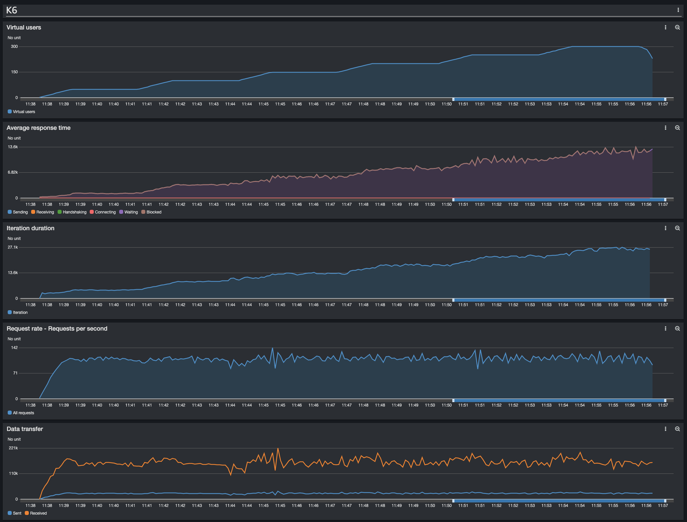

# k6-aws-cloudwatch-cdk
   

An AWS cloudwatch dashboard containing graphs for k6 performance metrics. 

[K6](https://github.com/loadimpact/k6) is a modern load testing tool built for developer happiness

[Amazon CloudWatch](https://aws.amazon.com/cloudwatch/) is a monitoring and observability service 

[The AWS Cloud Development Kit (AWS CDK)](https://aws.amazon.com/cdk/) is an open source software development framework to define your cloud application resources using familiar programming languages.

## Purpose
For fun, learning and profit 🤑 

Developed using TDD

## How to use
Presuming you already have an AWS account, have set up the AWS configuration and credential file settings and are running K6 tests on EC2, ECS.

- `npm install`

- `npm run deploy`

## Code analysis
ESlint is used for code quality analysis, the rules used for this project are similar to those used by AWS CDK project.

`npm run lint`

Prettier is used for code formatting analysis.

`npm run prettier`

The project configuration ensures ESLint and Prettier play nicely together.

## Unit tests

`npm run test`

There are three categories of [tests](https://github.com/aws/aws-cdk/blob/ce9ee507caf9e4524c52c26a8cd3f255e6921e15/packages/%40aws-cdk/assert/README.md) you can write for AWS CDK apps.

####📷 Snapshot tests
Snapshot tests test the synthesized AWS CloudFormation template against a previously-stored baseline template. This way, when you're refactoring your app, you can be sure that the refactored code works exactly the same way as the original. If the changes were intentional, you can accept a new baseline for future tests.
The snapshot artifact should be committed alongside code changes, and reviewed as part of your code review process. It lives here - `test/__snapshots__`

- `npm run test-snapshot` perform snapshot test
- `npm run accept-snapshot` accept the new snapshot

#### 🌾 Fine-grained assertions

Fine-grained assertions test specific aspects of the generated AWS CloudFormation template, such as "this resource has this property with this value." These tests help when you're developing new features, since any code you add will cause your snapshot test to fail even if existing features still work. When this happens, your fine-grained tests will reassure you that the existing functionality is unaffected. 

### ✅ Validation tests

Validation tests help you "fail fast" by making sure your AWS CDK constructs raise errors when you pass them invalid data. The ability to do this type of testing is a big advantage of developing your infrastructure in a general-purpose programming language.

### Mutation
Stryker used for mutation testing. A threshold of 80 mutation score enforced.

`npm run mutation`

## Resources used for development
[aws-cloudwatch module](https://docs.aws.amazon.com/cdk/api/latest/docs/aws-cloudwatch-readme.html), specifically the [dashboard construct](https://docs.aws.amazon.com/cdk/api/latest/docs/@aws-cdk_aws-cloudwatch.Dashboard.html)
- Understand the constructs 

CloudFormation resource [AWS::CloudWatch::Dashboard](https://docs.aws.amazon.com/AWSCloudFormation/latest/UserGuide/aws-resource-cloudwatch-dashboard.html)
- Understand the CloudFormation yaml for Cloudwatch

Cloudwatch API reference [Dashboard Body Structure and Syntax](https://docs.aws.amazon.com/AmazonCloudWatch/latest/APIReference/CloudWatch-Dashboard-Body-Structure.html)
- Understand the structure of the DashboardBody 

[K6 metrics](https://k6.io/docs/using-k6/metrics)
- Understand the metrics to display in graphs

[Testing utilities and assertions for CDK libraries](https://github.com/aws/aws-cdk/tree/master/packages/%40aws-cdk/assert)
- Understand @aws-cdk/assert

